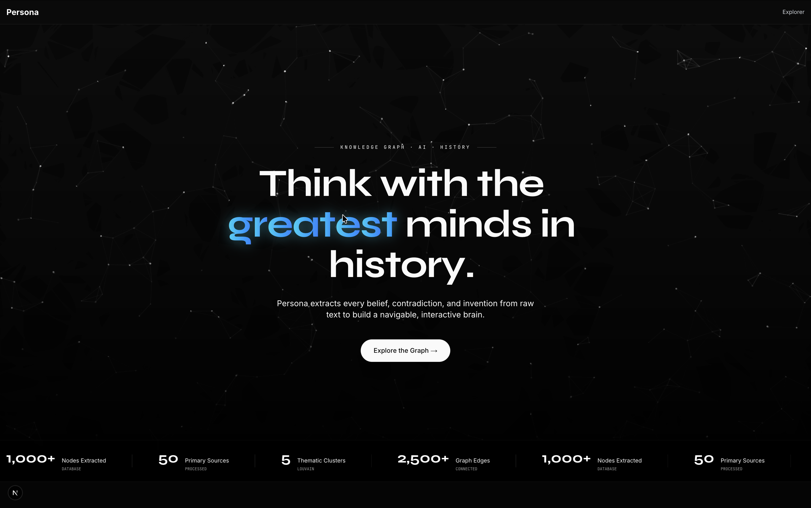
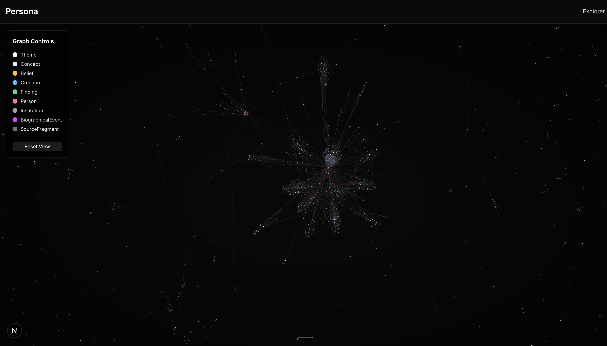

# Persona 🧠

> **The Greatest Minds in the Palm of Your Hand.**



**Persona** is a platform for navigating the intellectual DNA of historical and modern figures. We haven't just built a chatbot—we have built an **autonomous AI pipeline** that ingests everything a thinker ever wrote, said, or published, and constructs an interactive, multi-modal knowledge graph of their ideas, beliefs, creations, and contradictions. 

With Persona, you don't just talk to history. You explore it, question it, and visualize how world-changing ideas evolved over time.

---

## 🌌 The Universe of a Mind

Every great thinker is a universe of interconnected ideas. For our initial demo, we have fully mapped two of history's most brilliant minds: **Albert Einstein** and **Nikola Tesla**. 

When you explore a Persona, you are navigating an actual, highly structured graph database built entirely by AI reading primary sources.

### Albert Einstein


Every node in these graphs represents a distinct concept, belief, finding, or creation. Every edge represents a relationship—how one idea *influenced*, *supported*, or *contradicted* another. When you chat with these minds, the agent traverses this very graph to construct its answers, citing the exact source documents it used.

---

## ⚙️ How We Built It: The Architecture Deep-Dive

Building a digital clone of a human mind requires more than just a system prompt. It requires a robust, hybrid memory architecture. Here is the exact technical pipeline we built to make Persona a reality:

### Phase 1: The Autonomous BFS Source Gathering Agent
To capture a mind, we need their actual words, not just Wikipedia summaries. We built a Recursive Source Gathering Agent using **Tavily**, **Firecrawl**, and **Gemini**.
1. **Targeted Search**: The agent uses Tavily to search for primary sources (e.g., "Nikola Tesla original patents pdf", "Albert Einstein personal letters").
2. **Web Scraping & Local Parsing**: The agent routes URLs. Web pages are scraped into Markdown using **Firecrawl**. Documents (PDF, EPUB, TXT) are routed to a local parser using `unstructured` to save on scraping API costs.
3. **LLM Evaluation**: **Google Gemini (Flash-Lite)** reads the scraped markdown and evaluates the text. If the text is a high-quality primary source, it gives it a score (0-100). If it is a generic Wikipedia summary, it rejects it.
4. **Recursive Citations (BFS)**: The agent extracts hyperlinks from the text, asks Gemini if any of the links point to better citations, and adds them to a Breadth-First Search queue to autonomously follow trails of research across the internet.

### Phase 2: The Cognee Extraction Pipeline
We use **Cognee** (a hybrid graph-vector memory engine) to process the gathered sources.
1. **Chunking**: The top-ranked historical sources are sliced into ~800-token chunks.
2. **Structured LLM Extraction**: We pass each chunk to Gemini using Instructor (`json_mode`). The LLM is forced to extract exactly 8 ontological node types (e.g., `Concept`, `Belief`, `Creation`, `Finding`) and 5 specific relationship edge types (e.g., `supports`, `contradicts`, `evolved_from`, `influenced_by`).
3. **Deduplication**: Using Cognee's `Dedup()` deterministic hashing, identical concepts found in different documents are automatically merged into the exact same node.

### Phase 3: The Hybrid Database Layer
Cognee orchestrates the storage of this extracted intellectual DNA across three different databases simultaneously:
* **The Graph Layer (Neo4j)**: All nodes and relationships are written to a Neo4j database (using APOC plugins) to allow for complex traversal queries (e.g., "What beliefs contradict this concept?").
* **The Vector Layer (LanceDB / pgvector)**: All nodes are embedded using **Jina AI Embeddings** (2048 dims) and stored in a vector database for rapid semantic similarity search.
* **The Relational Layer (PostgreSQL)**: Document metadata, source chunk text, and system state are stored relationally.

---

## 🚀 How We Deployed It

Deploying a complex, hybrid graph-vector architecture to the cloud is notoriously difficult. Here is our serverless/containerized deployment strategy:

* **Frontend**: Next.js 15 app deployed on **Vercel** for edge-optimized performance and global CDN delivery.
* **Databases in the Cloud**: 
  * The graph is hosted on **Neo4j Aura**.
  * The relational metadata is hosted on **Render PostgreSQL**.
* **Backend**: The FastAPI Python application is containerized using **Docker** and deployed on **Render**.

### The Clever Deployment Trick: Embedded Vector Search
During the autonomous build phase, generating vector embeddings for thousands of text chunks takes time and LLM API credits. Instead of re-embedding everything on the cloud deployment, we utilized Cognee's local fallback database: **LanceDB**. 

When building a mind locally, Cognee saves the vector embeddings into a local, file-based LanceDB directory (`.cognee_system/`). We packaged this directory directly into our backend **Docker image**. When our Render web service boots up, it reads the vector embeddings instantly from the local container disk, while reaching out to Neo4j Aura and Cloud Postgres for the graph and metadata. 

This results in lightning-fast retrievals in the cloud with zero cold-start ingestion costs!

---

## 🛠️ Build It Yourself (Local Setup)

Want to build your own minds? Here is how to run the Persona pipeline on your local machine.

### Prerequisites
- Docker & Docker Compose
- Conda (Python 3.13)
- API Keys: Google Gemini (for LLM/Embeddings), Tavily, Firecrawl.

### 1. Setup the Backend
```bash
# Create and activate a pristine conda environment
conda create -n persona python=3.13
conda activate persona

# Install the massive ML dependencies
cd backend
pip install -r requirements.txt
```

### 2. Configure Environment
Create a `.env` file in the `backend/` directory:
```ini
# LLM & Embeddings
LLM_PROVIDER=gemini
LLM_MODEL=gemini/gemini-3.1-flash-lite
LLM_API_KEY=your_gemini_key

EMBEDDING_PROVIDER=gemini
EMBEDDING_MODEL=gemini/gemini-embedding-2
EMBEDDING_API_KEY=your_gemini_key

# Source Gathering Agents
FIRECRAWL_API_KEY=your_firecrawl_key
TAVILY_API_KEY=your_tavily_key

# Cloud/Local Databases
DB_PROVIDER=postgres
DB_HOST=localhost
DB_PORT=5433
DB_USERNAME=persona
DB_PASSWORD=persona
DB_NAME=persona

GRAPH_DATABASE_PROVIDER=neo4j
GRAPH_DATABASE_URL=bolt://localhost:7687
GRAPH_DATABASE_USERNAME=neo4j
GRAPH_DATABASE_PASSWORD=persona1
```

### 3. Start the Databases
We provide a `docker-compose.yml` that spins up PostgreSQL and Neo4j locally.
```bash
# In the root of the project
docker compose up -d
```

### 4. Build a Mind!
Trigger the BFS Agent and Cognee pipeline to scour the internet and build a knowledge graph autonomously:

```bash
cd backend
# Usage: python build_mind.py "Person Name" [Number of Sources to Ingest]
python build_mind.py "Isaac Newton" 15
```

### 5. Run the Frontend
```bash
cd frontend
npm install
npm run dev
```
Visit `http://localhost:3000` to explore the universe you just built.
